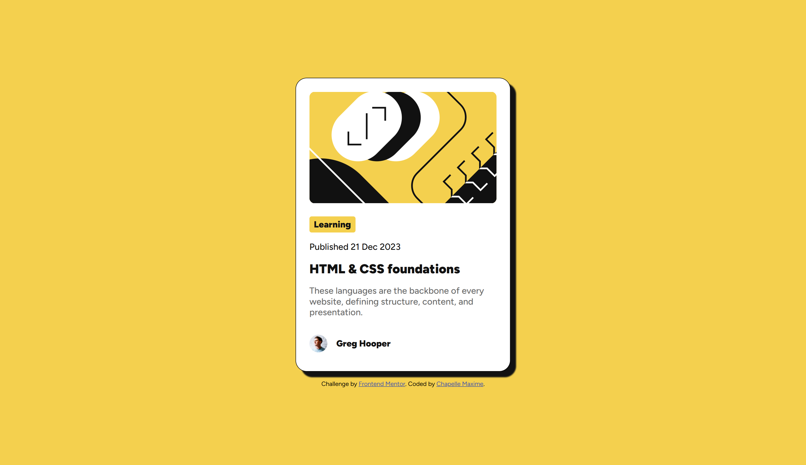

# Frontend Mentor - Blog preview card solution

This is a solution to the [Blog preview card challenge on Frontend Mentor](https://www.frontendmentor.io/challenges/blog-preview-card-ckPaj01IcS). Frontend Mentor challenges help you improve your coding skills by building realistic projects.

## Table of contents

- [Overview](#overview)
  - [The challenge](#the-challenge)
  - [Screenshot](#screenshot)
  - [Links](#links)
- [My process](#my-process)
  - [Built with](#built-with)
  - [What I learned](#what-i-learned)
  - [Continued development](#continued-development)
  - [Useful resources](#useful-resources)
  - [AI Collaboration](#ai-collaboration)
- [Author](#author)

## Overview

### The challenge

Users should be able to:

- See hover and focus states for all interactive elements on the page

### Screenshot

### Links

- Solution URL: [Add solution URL here](https://github.com/maxi1993-tech/blog-preview-card)
- Live Site URL: [https://maxi1993-tech.github.io/blog-preview-card](https://maxi1993-tech.github.io/blog-preview-card)

## My process

### Built with

- Semantic HTML5 markup
- CSS custom properties
- Flexbox
- Desktop-first workflow
- Local fonts (`@font-face`)

### What I learned

This project taught me how to use @font-face for local fonts, how CSS specificity works in practice, and how to make a card responsive with width + max-width. I also took my first real steps with Figma.

### Continued development

For my next projects I want to focus on Figma, semantic HTML, relative units, responsive design and CSS specificity. I also want to learn how to better organize my CSS to avoid redundant classes.

### Useful resources

- [MDN Web Docs](https://developer.mozilla.org) - I used it to look up @font-face syntax and CSS properties I wasn't sure about.

### AI Collaboration

I used Claude throughout the project. It guided me on HTML structure, CSS and responsive design — without ever writing the code for me. It asked me questions so I could find the answers myself, and helped me understand why things worked or didn't.

## Author

- Frontend Mentor - [@maxi1993-tech](https://www.frontendmentor.io/profile/maxi1993-tech)
- GitHub - [maxi1993-tech](https://github.com/maxi1993-tech)